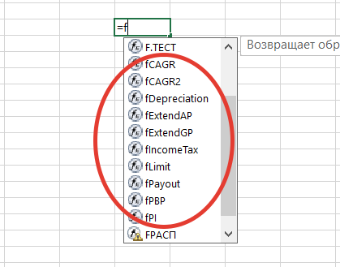

# InvestmentFunctions

This is an addin for Microsoft Excel which enables a few user-defined functions (UDFs) for financial and investment modelling.



# Features

- Contains 8 functions:
    - simple and discounted Payback Periods (PBP, DPBP) with option to extend cashflows
    - Profitability Index (PI)
    - payable sum from available cash flow and future cash flows
    - depreciation from a range of CAPEX values
    - Income Tax with Tax shield
    - 2 CAGR calculations: from range of values or from start and end values
    - Limitation of parameter value in target range
- Allows seamless work in groups by automatically updating Excel links to this addin

# Installation

1. Download and save "[InvestmentFunctions.xlam](https://github.com/OlegPyatakov/InvestmentFunctions/raw/master/InvestmentFunctions.xlam)"
2. Within Excel add the saved file as an addin

# InvestmentFunctions signatures and usage

You can also see usage examples in "InvestmentFunctions.xlsm" file.

## fCAGR - calculate CAGR from a range of cells

```
fCAGR(rValuesRange As Range) As Double
```

- Uses 1st row of the range, unless the 1 column of the cell range is longer

## fCAGR2 - calculate CAGR from start and end values

```
fCAGR2(dStartValue As Double, dEndValue As Double, dStartYear As Double, dEndYear As Double) As Double
```

## fDepreciation - calculate depreciation

```
fDepreciation(rCapex As Range, dDepreciationPeriod As Double) As Double
```

- "rCapex" - cell range with CAPEX values in previous periods

## fIncomeTax - calculate income tax

```
fIncomeTax(rProfitRange As Range, dTaxRate As Double, Optional dPriorProfitsAndLosses As Double) As Double
```

- Optional "dPriorProfitsAndLosses" - incoming amount of profit/losse for tax shield before 1st period. Negative value means losses.

## fLimit - limit parameter value in target range

```
fLimit(varInput, varLimit1, varLimit2
```

## fPayout - calculate payable sum from available cash flow and future cash flows

The formula calculates how much money can be safely paid from company's cash flow, so that in future company always have cash value above target minimum.

```
fPayout(dPayoutBase As Double, rFutureCashFlow As Range, Optional dWACC As Double, Optional dMinCashLimit As Double) As Double
```

- "dPayoutBase" - cash flow in current period
- "rFutureCashFlow" - cell range with future cash flows
- Optional "dWACC" - cost of capital. Unused cash every period is increased by the cost of capital. Defalut value = 0.
- Optional "dMinCashLimit" - minimum tager cash value. Defalut value = 0.

## fPBP - calculate simple and discounted payback periods

```
fPBP(varCashFlowRange As Range, Optional varDiscountRate As Variant, Optional varGrowthRate As Variant) As Variant
```

- "varCashFlowRange" - cell range with cash flow values. First cell is regarded as "zero" or "starting" period
- Optional "varDiscountRate" - discount rate. Default value = 0. If varDiscountRate = 0, then we basically calculate simple payback period.
- Optional "varGrowthRate" - used to extend cash flows in post term period. For example, if varGrowthRate = 1.05, then the formula will use the last cash flow value of the range and extend it multiplying by 1.05 every period. Default value = 0. Maximum number or extended periods = 360.

## fPI - calculate Profitability Index (PI)

```
fPI(varCashFlowRange As Range, Optional varDiscountRate As Variant) As Variant
```

- Optional "varDiscountRate" - discount rate. Default value = 0.
